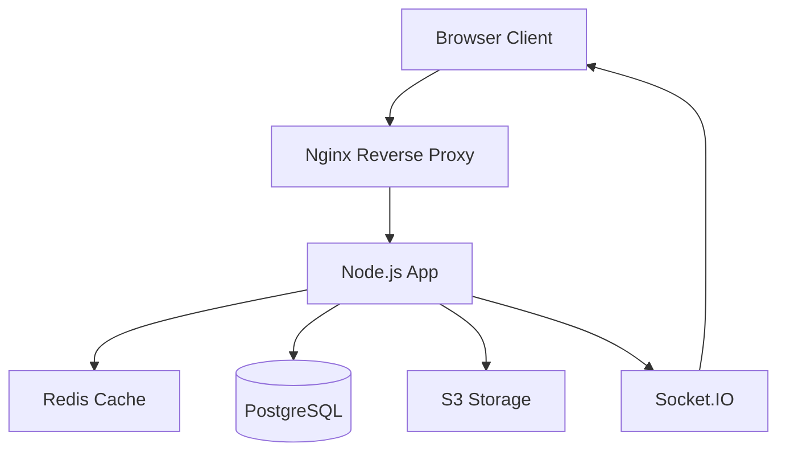

# Bluebonnet Travel Planner - Modernization & Optimization Plan

**Version:** 1.0
**Date:** 2025-11-16
**Focus Areas:** Feature Scalability, Functionality Growth, Clean Architecture

---

## Executive Summary

Bluebonnet is a well-structured travel planning application with solid fundamentals. The codebase demonstrates good MVC organization, comprehensive features, and modern build tooling. However, to support future growth and scalability, this plan addresses critical gaps in testing, code quality, architecture patterns, and performance optimization.

**Current State:** 7/10 - Functional and well-documented, lacking automated quality assurance and scalability patterns
**Target State:** 9/10 - Production-ready, scalable, maintainable, and extensible

---

## Phase 1: Foundation & Code Quality (Weeks 1-2)

### 1.1 Code Quality Infrastructure

**Priority:** CRITICAL
**Impact:** High - Prevents bugs, improves maintainability

#### Tasks:

**A. ESLint Configuration**
- Install ESLint with Airbnb or Standard config
- Configure rules for Node.js backend and browser frontend
- Add pre-commit hooks with husky
- Fix existing linting errors (estimate: 50-100 issues)

```bash
npm install --save-dev eslint eslint-config-airbnb-base eslint-plugin-import
npm install --save-dev husky lint-staged
```

**B. Prettier Integration**
- Install Prettier for consistent formatting
- Configure .prettierrc with project standards
- Integrate with ESLint (eslint-config-prettier)
- Format entire codebase

**C. EditorConfig**
- Create .editorconfig for consistent spacing/indentation
- Standardize on 2-space indentation, LF line endings

**Files to Create:**
- `.eslintrc.json`
- `.prettierrc`
- `.editorconfig`
- `.husky/pre-commit`
- `.lintstagedrc.json`

**Benefits:**
- Catch errors before runtime
- Consistent code style across team
- Automated formatting saves time

---

### 1.2 Logging Infrastructure

**Priority:** HIGH
**Impact:** High - Essential for debugging and monitoring

#### Current Issues:
- 129 console.log/console.error statements
- No log levels (debug, info, warn, error)
- No log rotation or persistence
- Production logs clutter console

#### Solution: Winston Logger

**Install:**
```bash
npm install winston winston-daily-rotate-file
```

**Implementation:**
```javascript
// utils/logger.js
const winston = require('winston');

const logger = winston.createLogger({
  level: process.env.LOG_LEVEL || 'info',
  format: winston.format.combine(
    winston.format.timestamp(),
    winston.format.errors({ stack: true }),
    winston.format.json()
  ),
  transports: [
    new winston.transports.DailyRotateFile({
      filename: 'logs/error-%DATE%.log',
      datePattern: 'YYYY-MM-DD',
      level: 'error',
      maxFiles: '30d'
    }),
    new winston.transports.DailyRotateFile({
      filename: 'logs/combined-%DATE%.log',
      datePattern: 'YYYY-MM-DD',
      maxFiles: '14d'
    })
  ]
});

if (process.env.NODE_ENV !== 'production') {
  logger.add(new winston.transports.Console({
    format: winston.format.simple()
  }));
}

module.exports = logger;
```

**Migration Strategy:**
1. Create logger utility
2. Replace console.log → logger.info
3. Replace console.error → logger.error
4. Add contextual logging (userId, tripId, etc.)
5. Remove debug logs or gate with logger.debug

**Benefits:**
- Searchable logs with timestamps
- Different log levels for filtering
- Log rotation prevents disk overflow
- Production-ready monitoring integration

---

### 1.3 Environment Configuration

**Priority:** HIGH
**Impact:** Medium - Security and deployment flexibility

#### Current Issues:
- No .env.example file
- Session secret hardcoded fallback
- Database credentials in docker-compose.yml
- Missing API key configuration examples

#### Tasks:

**Create .env.example:**
```bash
# Server Configuration
NODE_ENV=development
PORT=3000
SESSION_SECRET=your-secret-key-here-change-in-production

# Database Configuration
DB_HOST=localhost
DB_PORT=5432
DB_NAME=travel_planner
DB_USER=postgres
DB_PASSWORD=postgres

# API Keys (Optional)
AVIATION_STACK_API_KEY=
GEOCODING_API_KEY=

# Logging
LOG_LEVEL=info

# Session
SESSION_MAX_AGE=86400000
```

**Update server.js:**
```javascript
// Validate required env vars
const requiredEnvVars = ['SESSION_SECRET', 'DB_NAME'];
requiredEnvVars.forEach(varName => {
  if (!process.env[varName]) {
    logger.error(`Missing required environment variable: ${varName}`);
    process.exit(1);
  }
});
```

**Benefits:**
- Clear documentation of configuration
- Prevents accidental secret commits
- Easier deployment to different environments

---

## Phase 2: Database & ORM Improvements (Weeks 2-3)

### 2.1 Migration System

**Priority:** CRITICAL
**Impact:** High - Database safety and version control

#### Current Issues:
- Using `sync({ alter: true })` is DANGEROUS in production
- No migration history
- Manual SQL in server.js for constraints
- Schema changes not versioned

#### Solution: Sequelize Migrations

**Install CLI:**
```bash
npm install --save-dev sequelize-cli
```

**Setup:**
```bash
npx sequelize-cli init
```

**Create Initial Migration:**
```bash
npx sequelize-cli migration:generate --name initial-schema
```

**Migration Structure:**
```
migrations/
├── 20250116000001-initial-schema.js
├── 20250116000002-add-companion-indexes.js
├── 20250116000003-make-event-trip-nullable.js
└── ...
```

**Update package.json:**
```json
{
  "scripts": {
    "migrate": "sequelize-cli db:migrate",
    "migrate:undo": "sequelize-cli db:migrate:undo",
    "migrate:status": "sequelize-cli db:migrate:status",
    "seed": "sequelize-cli db:seed:all"
  }
}
```

**Remove from server.js:**
- All `sequelize.sync()` calls
- Manual index creation SQL
- ALTER TABLE statements

**Benefits:**
- Safe, reversible schema changes
- Version control for database structure
- Team coordination on schema changes
- Deployment automation

---

### 2.2 Query Optimization

**Priority:** MEDIUM
**Impact:** High - Performance at scale

#### Current Issues:
- Potential N+1 queries in trip listings
- Large includes loading unnecessary data
- No pagination on list endpoints
- Airport data (3.7MB) loaded into memory

#### Optimizations:

**A. Pagination for Trip Lists**
```javascript
// controllers/tripController.js
exports.listTrips = async (req, res) => {
  const page = parseInt(req.query.page) || 1;
  const limit = parseInt(req.query.limit) || 20;
  const offset = (page - 1) * limit;

  const { count, rows: trips } = await Trip.findAndCountAll({
    where: { userId: req.user.id },
    limit,
    offset,
    order: [['departureDate', 'ASC']],
    include: [/* ... */]
  });

  res.render('trips/dashboard', {
    trips,
    pagination: {
      total: count,
      page,
      pages: Math.ceil(count / limit)
    }
  });
};
```

**B. Selective Field Loading**
```javascript
// Only load needed fields
include: [{
  model: User,
  as: 'user',
  attributes: ['id', 'firstName', 'lastName'] // Don't load password, email, etc.
}]
```

**C. Database Indexes Review**
Current indexes are good, but add:
```sql
CREATE INDEX idx_trips_user_departure ON trips(userId, departureDate);
CREATE INDEX idx_flights_trip ON flights(tripId);
CREATE INDEX idx_hotels_trip ON hotels(tripId);
```

**D. Airport Data Optimization**
Move 3.7MB airports.json to database:
```javascript
// models/Airport.js
module.exports = (sequelize, DataTypes) => {
  const Airport = sequelize.define('Airport', {
    iata: { type: DataTypes.STRING(3), primaryKey: true },
    name: DataTypes.STRING,
    city: DataTypes.STRING,
    country: DataTypes.STRING,
    latitude: DataTypes.DECIMAL(10, 6),
    longitude: DataTypes.DECIMAL(10, 6)
  });
  return Airport;
};
```

Then use PostgreSQL full-text search:
```javascript
// Search airports
const airports = await Airport.findAll({
  where: {
    [Op.or]: [
      sequelize.where(
        sequelize.fn('LOWER', sequelize.col('name')),
        { [Op.like]: `%${query.toLowerCase()}%` }
      ),
      { iata: { [Op.iLike]: `${query}%` } }
    ]
  },
  limit: 10
});
```

**Benefits:**
- Faster page loads
- Reduced memory usage
- Scalable to thousands of trips
- Better UX with pagination

---

### 2.3 Connection Pool Configuration

**Priority:** MEDIUM
**Impact:** Medium - Handles concurrent users

#### Add to config/database.js:
```javascript
{
  pool: {
    max: 10,        // Maximum connections
    min: 2,         // Minimum connections
    acquire: 30000, // Maximum time to get connection
    idle: 10000     // Maximum idle time before release
  },
  logging: process.env.NODE_ENV === 'development' ? console.log : false
}
```

---

## Phase 3: Backend Architecture Refinement (Weeks 3-4)

### 3.1 Service Layer Pattern

**Priority:** MEDIUM
**Impact:** High - Separates business logic from controllers

#### Current Issues:
- Controllers contain business logic (961 lines in tripController)
- Difficult to reuse logic across controllers
- Hard to test business rules
- Mixed concerns (HTTP + business logic)

#### Solution: Introduce Service Layer

**New Structure:**
```
services/
├── external/                    # External API services
│   ├── airportService.js       # Existing
│   ├── geocodingService.js     # Existing
│   └── aviationStackService.js # Existing
├── business/                   # NEW - Business logic
│   ├── tripService.js
│   ├── companionService.js
│   ├── voucherService.js
│   ├── notificationService.js
│   └── permissionService.js
└── data/                       # NEW - Data access layer
    ├── tripRepository.js
    ├── companionRepository.js
    └── voucherRepository.js
```

**Example Service:**
```javascript
// services/business/tripService.js
const { Trip, Flight, Hotel } = require('../../models');
const tripRepository = require('../data/tripRepository');
const logger = require('../../utils/logger');

class TripService {
  async createTrip(userId, tripData) {
    logger.info('Creating trip', { userId, tripName: tripData.name });

    // Validation
    if (new Date(tripData.departureDate) >= new Date(tripData.returnDate)) {
      throw new Error('Return date must be after departure date');
    }

    // Business logic
    const trip = await tripRepository.create({
      userId,
      ...tripData,
      defaultCompanionEditPermission: false
    });

    logger.info('Trip created', { tripId: trip.id, userId });
    return trip;
  }

  async getTripWithItems(tripId, userId) {
    const trip = await tripRepository.findByIdWithItems(tripId);

    if (!trip) {
      throw new Error('Trip not found');
    }

    // Check permissions
    const hasAccess = await this.checkUserAccess(trip, userId);
    if (!hasAccess) {
      throw new Error('Access denied');
    }

    return trip;
  }

  async checkUserAccess(trip, userId) {
    // Owner has access
    if (trip.userId === userId) return true;

    // Check if user is a companion
    const companion = trip.tripCompanions?.find(
      tc => tc.companion.userId === userId
    );

    return !!companion;
  }
}

module.exports = new TripService();
```

**Updated Controller:**
```javascript
// controllers/tripController.js
const tripService = require('../services/business/tripService');
const logger = require('../utils/logger');

exports.createTrip = async (req, res) => {
  try {
    const trip = await tripService.createTrip(req.user.id, req.body);

    req.flash('success_msg', 'Trip created successfully');
    res.redirect(`/trips/${trip.id}`);
  } catch (error) {
    logger.error('Error creating trip', { error, userId: req.user.id });
    req.flash('error_msg', error.message);
    res.redirect('/trips/new');
  }
};

exports.getTrip = async (req, res) => {
  try {
    const trip = await tripService.getTripWithItems(req.params.id, req.user.id);

    res.render('trips/trip', { trip });
  } catch (error) {
    logger.error('Error fetching trip', { error, tripId: req.params.id });
    res.status(error.message === 'Access denied' ? 403 : 404);
    res.render('error', { error });
  }
};
```

**Benefits:**
- Testable business logic (unit tests for services)
- Reusable across controllers and even CLI scripts
- Cleaner controllers (just HTTP handling)
- Easier to maintain and extend

---

### 3.2 Middleware Enhancements

**Priority:** LOW
**Impact:** Medium - Better code organization

#### Current State:
- Auth middleware exists
- Validation middleware exists
- Could improve organization

#### Enhancements:

**A. Request Logging Middleware**
```javascript
// middleware/requestLogger.js
const logger = require('../utils/logger');

module.exports = (req, res, next) => {
  const start = Date.now();

  res.on('finish', () => {
    const duration = Date.now() - start;
    logger.info('Request completed', {
      method: req.method,
      path: req.path,
      statusCode: res.statusCode,
      duration,
      userId: req.user?.id
    });
  });

  next();
};
```

**B. Error Handling Middleware Enhancement**
```javascript
// middleware/errorHandler.js
const logger = require('../utils/logger');

class AppError extends Error {
  constructor(message, statusCode) {
    super(message);
    this.statusCode = statusCode;
    this.isOperational = true;
  }
}

const errorHandler = (err, req, res, next) => {
  err.statusCode = err.statusCode || 500;

  logger.error('Error occurred', {
    error: err.message,
    stack: err.stack,
    path: req.path,
    userId: req.user?.id
  });

  if (process.env.NODE_ENV === 'production' && !err.isOperational) {
    // Don't leak error details in production
    res.status(500).render('error', {
      title: 'Error',
      error: { message: 'Something went wrong' }
    });
  } else {
    res.status(err.statusCode).render('error', {
      title: 'Error',
      error: err
    });
  }
};

module.exports = { AppError, errorHandler };
```

**C. Rate Limiting**
```javascript
// middleware/rateLimiter.js
const rateLimit = require('express-rate-limit');

const apiLimiter = rateLimit({
  windowMs: 15 * 60 * 1000, // 15 minutes
  max: 100, // Limit each IP to 100 requests per windowMs
  message: 'Too many requests, please try again later'
});

const authLimiter = rateLimit({
  windowMs: 15 * 60 * 1000,
  max: 5, // 5 login attempts
  skipSuccessfulRequests: true
});

module.exports = { apiLimiter, authLimiter };
```

**Benefits:**
- Better security (rate limiting)
- Debugging easier (request logging)
- Consistent error handling

---

### 3.3 API Versioning

**Priority:** LOW
**Impact:** High - Future-proofs API changes

#### Current State:
- Single API route at `/api`
- No versioning strategy
- Breaking changes would affect all clients

#### Solution: Version API Routes

**New Structure:**
```javascript
// routes/api/v1/index.js
const express = require('express');
const router = express.Router();

router.use('/trips', require('./trips'));
router.use('/companions', require('./companions'));
router.use('/notifications', require('./notifications'));

module.exports = router;

// server.js
app.use('/api/v1', require('./routes/api/v1'));
app.use('/api', require('./routes/api/v1')); // Default to v1
```

**Benefits:**
- Can introduce breaking changes in v2 without affecting v1 clients
- Mobile app development easier
- Third-party integrations safer

---

## Phase 4: Frontend Modernization (Weeks 4-6)

### 4.1 Bundle Size Optimization

**Priority:** HIGH
**Impact:** High - Page load performance

#### Current Issues:
- trip-view.js: 529.5 KB (too large)
- Preline UI: 388 KB (loaded upfront)
- No compression
- No lazy loading for heavy libraries

#### Solutions:

**A. Lazy Load Preline UI**
```javascript
// public/js/preline-lazy-loader.js
export async function loadPreline() {
  if (window.HSStaticMethods) {
    return; // Already loaded
  }

  const { default: Preline } = await import('./preline.js');
  window.HSStaticMethods = Preline;
  Preline.autoInit();
}

// Load on demand
document.addEventListener('DOMContentLoaded', async () => {
  // Only load if we see Preline components
  if (document.querySelector('[data-hs-component]')) {
    await loadPreline();
  }
});
```

**B. Code Splitting Enhancement**
```javascript
// esbuild.config.js
{
  splitting: true,
  chunkNames: 'chunks/[name]-[hash]',
  // Let esbuild automatically split shared code
  manualChunks: {
    'vendor': ['preline', 'vanilla-calendar-pro', 'leaflet']
  }
}
```

**C. Compression Middleware**
```javascript
// Install compression
npm install compression

// server.js
const compression = require('compression');
app.use(compression());
```

**D. Optimize Leaflet Loading**
```javascript
// Only load maps when needed
export async function initMap(elementId, options) {
  const [L, { default: leafletCss }] = await Promise.all([
    import('leaflet'),
    import('leaflet/dist/leaflet.css')
  ]);

  return L.map(elementId, options);
}
```

**Expected Results:**
- trip-view.js: 529 KB → ~180 KB (vendor chunk separate)
- Faster initial page load
- Better caching (vendor chunk changes rarely)

---

### 4.2 Replace Polling with WebSockets

**Priority:** MEDIUM
**Impact:** High - Real-time performance and server load

#### Current Issue:
- Notifications poll every 30 seconds
- Inefficient: unnecessary requests when no updates
- Doesn't scale well

#### Solution: Socket.IO for Real-Time Updates

**Install:**
```bash
npm install socket.io
```

**Server Setup:**
```javascript
// server.js
const http = require('http');
const socketIo = require('socket.io');

const server = http.createServer(app);
const io = socketIo(server, {
  cors: { origin: process.env.CLIENT_URL || '*' }
});

// Socket authentication
io.use((socket, next) => {
  const sessionMiddleware = session({
    secret: process.env.SESSION_SECRET,
    resave: false,
    saveUninitialized: false
  });

  sessionMiddleware(socket.request, {}, next);
});

io.on('connection', (socket) => {
  const userId = socket.request.session?.passport?.user;

  if (!userId) {
    socket.disconnect();
    return;
  }

  // Join user's personal room
  socket.join(`user:${userId}`);

  logger.info('User connected', { userId, socketId: socket.id });

  socket.on('disconnect', () => {
    logger.info('User disconnected', { userId, socketId: socket.id });
  });
});

// Export io for use in other files
app.set('io', io);

// Use server.listen instead of app.listen
server.listen(PORT, () => {
  console.log(`Server running on port ${PORT}`);
});
```

**Notification Service Update:**
```javascript
// services/business/notificationService.js
class NotificationService {
  async createNotification(userId, notificationData) {
    const notification = await Notification.create({
      userId,
      ...notificationData
    });

    // Emit real-time event
    const io = require('../../server').app.get('io');
    io.to(`user:${userId}`).emit('notification:new', notification);

    return notification;
  }
}
```

**Frontend:**
```javascript
// public/js/notifications-socket.js
import { io } from 'socket.io-client';

const socket = io({
  autoConnect: true,
  reconnection: true
});

socket.on('connect', () => {
  console.log('Connected to notification service');
});

socket.on('notification:new', (notification) => {
  // Update UI
  updateNotificationBadge();
  showNotificationToast(notification);
});

socket.on('notification:read', (notificationId) => {
  // Update UI
  markNotificationAsRead(notificationId);
});

export { socket };
```

**Benefits:**
- Real-time updates (no delay)
- 95% reduction in HTTP requests
- Better UX (instant notifications)
- Scalable with Redis adapter

---

### 4.3 State Management

**Priority:** LOW
**Impact:** Medium - Frontend maintainability

#### Current State:
- State scattered across modules
- Global variables on window object
- No centralized state management

#### Solution: Lightweight State Management

**Option 1: Simple Event Bus (Recommended for current size)**
```javascript
// public/js/eventBus.js
class EventBus {
  constructor() {
    this.events = {};
  }

  on(event, callback) {
    if (!this.events[event]) {
      this.events[event] = [];
    }
    this.events[event].push(callback);
  }

  emit(event, data) {
    if (this.events[event]) {
      this.events[event].forEach(callback => callback(data));
    }
  }

  off(event, callback) {
    if (this.events[event]) {
      this.events[event] = this.events[event].filter(cb => cb !== callback);
    }
  }
}

export const eventBus = new EventBus();
```

**Usage:**
```javascript
// Sidebar updates
import { eventBus } from './eventBus.js';

// In sidebar-loader.js
export async function loadSidebarContent(tripId, itemType, itemId) {
  const html = await fetchSidebarContent(tripId, itemType, itemId);
  updateSidebar(html);

  // Notify other components
  eventBus.emit('sidebar:loaded', { tripId, itemType, itemId });
}

// In another module
eventBus.on('sidebar:loaded', ({ tripId }) => {
  refreshTripData(tripId);
});
```

**Option 2: Zustand (For larger growth)**
If application grows significantly:
```bash
npm install zustand
```

```javascript
// public/js/store.js
import create from 'zustand';

export const useStore = create((set) => ({
  notifications: [],
  unreadCount: 0,
  currentTrip: null,

  addNotification: (notification) => set((state) => ({
    notifications: [notification, ...state.notifications],
    unreadCount: state.unreadCount + 1
  })),

  markAsRead: (id) => set((state) => ({
    notifications: state.notifications.map(n =>
      n.id === id ? { ...n, read: true } : n
    ),
    unreadCount: Math.max(0, state.unreadCount - 1)
  })),

  setCurrentTrip: (trip) => set({ currentTrip: trip })
}));
```

**Benefits:**
- Predictable state updates
- Easier debugging
- Less coupling between modules
- Testable state logic

---

### 4.4 Remove Global Function Pollution

**Priority:** MEDIUM
**Impact:** Medium - Cleaner global scope

#### Current Issue:
- 15+ functions on window object
- Necessary for inline onclick handlers

#### Solution: Data Attributes + Event Delegation

**Instead of:**
```html
<button onclick="editItem('flight', '123')">Edit</button>
```

**Use:**
```html
<button data-action="edit-item" data-type="flight" data-id="123">Edit</button>
```

**Event Delegation:**
```javascript
// public/js/event-handlers.js
import { loadSidebarContent } from './sidebar-loader.js';
import { deleteItem } from './trip-view-utils.js';

document.addEventListener('click', async (e) => {
  const target = e.target.closest('[data-action]');
  if (!target) return;

  const action = target.dataset.action;
  const { type, id, tripId } = target.dataset;

  switch (action) {
    case 'edit-item':
      await loadSidebarContent(tripId, type, id);
      break;
    case 'delete-item':
      await deleteItem(type, id);
      break;
    case 'add-item':
      await loadSidebarContent(tripId, type, 'new');
      break;
    // ... other actions
  }
});
```

**Benefits:**
- Clean global scope
- Better performance (single listener)
- Easier to add new actions
- No function name conflicts

---

## Phase 5: Testing Infrastructure (Weeks 6-7)

### 5.1 Unit Testing Setup

**Priority:** CRITICAL
**Impact:** Very High - Code quality and confidence

#### Install Testing Framework:
```bash
npm install --save-dev jest supertest @types/jest
npm install --save-dev @testing-library/dom @testing-library/user-event
```

#### Configure Jest:
```javascript
// jest.config.js
module.exports = {
  testEnvironment: 'node',
  coverageDirectory: 'coverage',
  collectCoverageFrom: [
    'controllers/**/*.js',
    'services/**/*.js',
    'utils/**/*.js',
    'middleware/**/*.js',
    '!**/node_modules/**'
  ],
  coverageThreshold: {
    global: {
      branches: 70,
      functions: 70,
      lines: 70,
      statements: 70
    }
  },
  testMatch: [
    '**/__tests__/**/*.test.js',
    '**/?(*.)+(spec|test).js'
  ],
  setupFilesAfterEnv: ['<rootDir>/tests/setup.js']
};
```

#### Test Structure:
```
tests/
├── setup.js                    # Test configuration
├── unit/
│   ├── services/
│   │   ├── tripService.test.js
│   │   ├── companionService.test.js
│   │   └── voucherService.test.js
│   ├── utils/
│   │   ├── dateFormatter.test.js
│   │   └── timezoneHelper.test.js
│   └── middleware/
│       ├── auth.test.js
│       └── validation.test.js
├── integration/
│   ├── trips.test.js
│   ├── companions.test.js
│   └── auth.test.js
└── e2e/
    └── user-journey.test.js
```

#### Example Tests:

**Unit Test:**
```javascript
// tests/unit/services/tripService.test.js
const tripService = require('../../../services/business/tripService');
const tripRepository = require('../../../services/data/tripRepository');

jest.mock('../../../services/data/tripRepository');

describe('TripService', () => {
  describe('createTrip', () => {
    it('should create a trip with valid data', async () => {
      const userId = 'user-123';
      const tripData = {
        name: 'Paris Trip',
        departureDate: '2025-06-01',
        returnDate: '2025-06-10',
        purpose: 'pleasure'
      };

      tripRepository.create.mockResolvedValue({
        id: 'trip-456',
        ...tripData,
        userId
      });

      const trip = await tripService.createTrip(userId, tripData);

      expect(trip.id).toBe('trip-456');
      expect(trip.name).toBe('Paris Trip');
      expect(tripRepository.create).toHaveBeenCalledWith({
        userId,
        ...tripData,
        defaultCompanionEditPermission: false
      });
    });

    it('should throw error when return date is before departure', async () => {
      const userId = 'user-123';
      const tripData = {
        name: 'Invalid Trip',
        departureDate: '2025-06-10',
        returnDate: '2025-06-01'
      };

      await expect(tripService.createTrip(userId, tripData))
        .rejects
        .toThrow('Return date must be after departure date');
    });
  });
});
```

**Integration Test:**
```javascript
// tests/integration/trips.test.js
const request = require('supertest');
const app = require('../../server');
const { User, Trip } = require('../../models');

describe('Trip Routes', () => {
  let user;
  let authCookie;

  beforeEach(async () => {
    // Create test user
    user = await User.create({
      email: 'test@example.com',
      password: 'hashedpassword',
      firstName: 'Test',
      lastName: 'User'
    });

    // Login to get session cookie
    const loginRes = await request(app)
      .post('/auth/login')
      .send({ email: 'test@example.com', password: 'password' });

    authCookie = loginRes.headers['set-cookie'];
  });

  afterEach(async () => {
    await Trip.destroy({ where: {} });
    await User.destroy({ where: {} });
  });

  describe('POST /trips', () => {
    it('should create a new trip', async () => {
      const res = await request(app)
        .post('/trips')
        .set('Cookie', authCookie)
        .send({
          name: 'Test Trip',
          departureDate: '2025-06-01',
          returnDate: '2025-06-10',
          purpose: 'pleasure'
        });

      expect(res.status).toBe(302); // Redirect

      const trips = await Trip.findAll({ where: { userId: user.id } });
      expect(trips).toHaveLength(1);
      expect(trips[0].name).toBe('Test Trip');
    });
  });
});
```

#### Update package.json:
```json
{
  "scripts": {
    "test": "jest",
    "test:watch": "jest --watch",
    "test:coverage": "jest --coverage",
    "test:unit": "jest tests/unit",
    "test:integration": "jest tests/integration"
  }
}
```

**Benefits:**
- Catch bugs before deployment
- Refactor with confidence
- Documentation through tests
- CI/CD integration

---

### 5.2 E2E Testing (Optional)

**Priority:** LOW
**Impact:** Medium - Full user journey validation

#### Install Playwright:
```bash
npm install --save-dev @playwright/test
npx playwright install
```

#### Example E2E Test:
```javascript
// tests/e2e/trip-creation.spec.js
const { test, expect } = require('@playwright/test');

test('complete trip creation flow', async ({ page }) => {
  // Login
  await page.goto('http://localhost:3000/auth/login');
  await page.fill('input[name="email"]', 'test@example.com');
  await page.fill('input[name="password"]', 'password');
  await page.click('button[type="submit"]');

  // Navigate to trip creation
  await page.click('text=New Trip');

  // Fill trip form
  await page.fill('input[name="name"]', 'Summer Vacation');
  await page.fill('input[name="departureDate"]', '2025-07-01');
  await page.fill('input[name="returnDate"]', '2025-07-15');
  await page.selectOption('select[name="purpose"]', 'pleasure');

  // Submit
  await page.click('button:has-text("Create Trip")');

  // Verify success
  await expect(page.locator('.success_msg')).toContainText('Trip created successfully');
  await expect(page.locator('h1')).toContainText('Summer Vacation');
});
```

---

## Phase 6: Performance & Scalability (Weeks 7-8)

### 6.1 Caching Strategy

**Priority:** MEDIUM
**Impact:** High - Response time improvement

#### Install Redis:
```bash
npm install redis connect-redis
```

#### Session Store (Replace in-memory sessions):
```javascript
// server.js
const RedisStore = require('connect-redis').default;
const { createClient } = require('redis');

const redisClient = createClient({
  host: process.env.REDIS_HOST || 'localhost',
  port: process.env.REDIS_PORT || 6379,
  legacyMode: true
});

redisClient.connect().catch(console.error);

app.use(session({
  store: new RedisStore({ client: redisClient }),
  secret: process.env.SESSION_SECRET,
  resave: false,
  saveUninitialized: false,
  cookie: {
    maxAge: 1000 * 60 * 60 * 24,
    secure: process.env.NODE_ENV === 'production'
  }
}));
```

#### Cache Frequent Queries:
```javascript
// utils/cache.js
const redis = require('redis');
const logger = require('./logger');

const client = redis.createClient({
  host: process.env.REDIS_HOST || 'localhost',
  port: process.env.REDIS_PORT || 6379
});

client.on('error', (err) => logger.error('Redis error', { error: err }));
client.connect();

async function getOrSet(key, fetchFn, ttl = 3600) {
  try {
    const cached = await client.get(key);
    if (cached) {
      logger.debug('Cache hit', { key });
      return JSON.parse(cached);
    }

    logger.debug('Cache miss', { key });
    const data = await fetchFn();
    await client.setEx(key, ttl, JSON.stringify(data));

    return data;
  } catch (error) {
    logger.error('Cache error', { error, key });
    return fetchFn(); // Fallback to direct fetch
  }
}

async function invalidate(pattern) {
  try {
    const keys = await client.keys(pattern);
    if (keys.length > 0) {
      await client.del(keys);
      logger.info('Cache invalidated', { pattern, count: keys.length });
    }
  } catch (error) {
    logger.error('Cache invalidation error', { error, pattern });
  }
}

module.exports = { getOrSet, invalidate, client };
```

#### Usage in Services:
```javascript
// services/business/tripService.js
const cache = require('../../utils/cache');

async function getTrip(tripId) {
  return cache.getOrSet(
    `trip:${tripId}`,
    () => tripRepository.findById(tripId),
    300 // 5 minutes
  );
}

async function updateTrip(tripId, data) {
  const trip = await tripRepository.update(tripId, data);

  // Invalidate cache
  await cache.invalidate(`trip:${tripId}`);
  await cache.invalidate(`user:${trip.userId}:trips`);

  return trip;
}
```

#### Cache Airport Data:
```javascript
// On server startup
const airports = JSON.parse(fs.readFileSync('./data/airports.json'));
cache.client.set('airports:all', JSON.stringify(airports), {
  EX: 86400 // 24 hours
});

// In airportService.js
async function searchAirports(query) {
  const airports = await cache.getOrSet(
    'airports:all',
    () => loadAirportsFromDB(),
    86400
  );

  return airports.filter(a =>
    a.name.toLowerCase().includes(query.toLowerCase()) ||
    a.iata.toLowerCase().startsWith(query.toLowerCase())
  ).slice(0, 10);
}
```

**Benefits:**
- 10x faster repeated queries
- Reduced database load
- Horizontal scaling support
- Session persistence across restarts

---

### 6.2 Database Optimization

**Priority:** HIGH
**Impact:** High - Query performance

#### Add Indexes:
```javascript
// migrations/YYYYMMDDHHMMSS-add-performance-indexes.js
module.exports = {
  up: async (queryInterface, Sequelize) => {
    await queryInterface.addIndex('trips', ['userId', 'departureDate'], {
      name: 'idx_trips_user_departure'
    });

    await queryInterface.addIndex('flights', ['tripId', 'departureDateTime'], {
      name: 'idx_flights_trip_departure'
    });

    await queryInterface.addIndex('hotels', ['tripId', 'checkIn'], {
      name: 'idx_hotels_trip_checkin'
    });

    await queryInterface.addIndex('notifications', ['userId', 'read', 'createdAt'], {
      name: 'idx_notifications_user_read_created'
    });
  },

  down: async (queryInterface) => {
    await queryInterface.removeIndex('trips', 'idx_trips_user_departure');
    await queryInterface.removeIndex('flights', 'idx_flights_trip_departure');
    await queryInterface.removeIndex('hotels', 'idx_hotels_trip_checkin');
    await queryInterface.removeIndex('notifications', 'idx_notifications_user_read_created');
  }
};
```

#### Connection Pooling:
Already covered in 2.3

#### Query Monitoring:
```javascript
// config/database.js
{
  logging: (sql, timing) => {
    if (timing > 1000) { // Log slow queries
      logger.warn('Slow query detected', { sql, timing });
    }
  },
  benchmark: true
}
```

---

### 6.3 Static Asset Optimization

**Priority:** MEDIUM
**Impact:** Medium - Page load speed

#### Add Asset Compression:
```javascript
// Already covered - compression middleware
```

#### CDN for Static Assets:
```javascript
// config/cdn.js
const CDN_URL = process.env.CDN_URL || '';

function getCDNUrl(path) {
  if (process.env.NODE_ENV === 'production' && CDN_URL) {
    return `${CDN_URL}${path}`;
  }
  return path;
}

// In templates
res.locals.cdn = getCDNUrl;

// In EJS:
// <script src="<%= cdn(getBundle('common')) %>"></script>
```

#### Image Optimization:
```bash
npm install sharp
```

```javascript
// middleware/imageUpload.js
const sharp = require('sharp');
const multer = require('multer');

const upload = multer({
  storage: multer.memoryStorage(),
  limits: { fileSize: 5 * 1024 * 1024 } // 5MB
});

async function processImage(req, res, next) {
  if (!req.file) return next();

  try {
    const optimized = await sharp(req.file.buffer)
      .resize(1200, 1200, { fit: 'inside', withoutEnlargement: true })
      .jpeg({ quality: 85 })
      .toBuffer();

    req.file.buffer = optimized;
    next();
  } catch (error) {
    next(error);
  }
}

module.exports = { upload, processImage };
```

---

## Phase 7: DevOps & Deployment (Week 8-9)

### 7.1 CI/CD Pipeline

**Priority:** HIGH
**Impact:** High - Automated quality checks

#### GitHub Actions Workflow:

**Create `.github/workflows/ci.yml`:**
```yaml
name: CI/CD Pipeline

on:
  push:
    branches: [main, develop]
  pull_request:
    branches: [main, develop]

jobs:
  test:
    runs-on: ubuntu-latest

    services:
      postgres:
        image: postgres:15-alpine
        env:
          POSTGRES_DB: test_travel_planner
          POSTGRES_USER: postgres
          POSTGRES_PASSWORD: postgres
        ports:
          - 5432:5432
        options: >-
          --health-cmd pg_isready
          --health-interval 10s
          --health-timeout 5s
          --health-retries 5

    steps:
      - uses: actions/checkout@v3

      - name: Setup Node.js
        uses: actions/setup-node@v3
        with:
          node-version: '18'
          cache: 'npm'

      - name: Install dependencies
        run: npm ci

      - name: Run linter
        run: npm run lint

      - name: Run tests
        run: npm run test:coverage
        env:
          DB_HOST: localhost
          DB_PORT: 5432
          DB_NAME: test_travel_planner
          DB_USER: postgres
          DB_PASSWORD: postgres
          SESSION_SECRET: test-secret

      - name: Upload coverage
        uses: codecov/codecov-action@v3
        with:
          file: ./coverage/coverage-final.json

      - name: Build production bundles
        run: npm run build:prod

      - name: Check bundle sizes
        run: |
          node scripts/check-bundle-size.js

  deploy:
    needs: test
    runs-on: ubuntu-latest
    if: github.ref == 'refs/heads/main'

    steps:
      - uses: actions/checkout@v3

      - name: Deploy to production
        run: |
          # Add deployment script here
          echo "Deploy to production"
```

**Create `scripts/check-bundle-size.js`:**
```javascript
const fs = require('fs');
const path = require('path');

const MAX_BUNDLE_SIZE = 300 * 1024; // 300KB
const distPath = path.join(__dirname, '../public/dist');

const files = fs.readdirSync(distPath)
  .filter(f => f.endsWith('.js') && !f.includes('.map'));

let failed = false;

files.forEach(file => {
  const stats = fs.statSync(path.join(distPath, file));
  const sizeKB = (stats.size / 1024).toFixed(2);

  if (stats.size > MAX_BUNDLE_SIZE) {
    console.error(`❌ ${file}: ${sizeKB} KB (exceeds ${MAX_BUNDLE_SIZE/1024}KB limit)`);
    failed = true;
  } else {
    console.log(`✅ ${file}: ${sizeKB} KB`);
  }
});

if (failed) {
  process.exit(1);
}
```

---

### 7.2 Docker Optimization

**Priority:** MEDIUM
**Impact:** Medium - Production deployment

#### Multi-stage Dockerfile:
```dockerfile
# Build stage
FROM node:18-alpine AS builder

WORKDIR /app

COPY package*.json ./
RUN npm ci --only=production

COPY . .
RUN npm run build:prod

# Production stage
FROM node:18-alpine

WORKDIR /app

# Create non-root user
RUN addgroup -g 1001 -S nodejs && \
    adduser -S nodejs -u 1001

# Copy dependencies
COPY --from=builder --chown=nodejs:nodejs /app/node_modules ./node_modules

# Copy application code
COPY --chown=nodejs:nodejs . .
COPY --from=builder --chown=nodejs:nodejs /app/public/dist ./public/dist

# Switch to non-root user
USER nodejs

EXPOSE 3000

# Health check
HEALTHCHECK --interval=30s --timeout=3s --start-period=5s --retries=3 \
  CMD node -e "require('http').get('http://localhost:3000/health', (r) => process.exit(r.statusCode === 200 ? 0 : 1))"

CMD ["node", "server.js"]
```

#### Health Check Endpoint:
```javascript
// server.js
app.get('/health', async (req, res) => {
  try {
    // Check database connection
    await db.sequelize.authenticate();

    res.status(200).json({
      status: 'healthy',
      timestamp: new Date().toISOString(),
      uptime: process.uptime()
    });
  } catch (error) {
    logger.error('Health check failed', { error });
    res.status(503).json({
      status: 'unhealthy',
      error: error.message
    });
  }
});
```

#### Docker Compose for Production:
```yaml
# docker-compose.prod.yml
version: '3.8'

services:
  app:
    build:
      context: .
      dockerfile: Dockerfile
    restart: always
    environment:
      NODE_ENV: production
      DB_HOST: postgres
    env_file:
      - .env.production
    depends_on:
      postgres:
        condition: service_healthy
      redis:
        condition: service_healthy
    networks:
      - app-network
    deploy:
      replicas: 2
      resources:
        limits:
          cpus: '1'
          memory: 512M

  postgres:
    image: postgres:15-alpine
    restart: always
    volumes:
      - postgres_data:/var/lib/postgresql/data
    environment:
      POSTGRES_DB: ${DB_NAME}
      POSTGRES_USER: ${DB_USER}
      POSTGRES_PASSWORD: ${DB_PASSWORD}
    networks:
      - app-network
    healthcheck:
      test: ["CMD-SHELL", "pg_isready -U ${DB_USER}"]
      interval: 10s
      timeout: 5s
      retries: 5

  redis:
    image: redis:7-alpine
    restart: always
    volumes:
      - redis_data:/data
    networks:
      - app-network
    healthcheck:
      test: ["CMD", "redis-cli", "ping"]
      interval: 10s
      timeout: 3s
      retries: 5

  nginx:
    image: nginx:alpine
    restart: always
    ports:
      - "80:80"
      - "443:443"
    volumes:
      - ./nginx.conf:/etc/nginx/nginx.conf:ro
      - ./ssl:/etc/nginx/ssl:ro
    depends_on:
      - app
    networks:
      - app-network

volumes:
  postgres_data:
  redis_data:

networks:
  app-network:
    driver: bridge
```

---

### 7.3 Monitoring & Observability

**Priority:** MEDIUM
**Impact:** High - Production debugging

#### Application Performance Monitoring:
```bash
npm install newrelic
# or
npm install @sentry/node
```

#### Sentry Integration:
```javascript
// server.js (at the top)
const Sentry = require('@sentry/node');

if (process.env.NODE_ENV === 'production') {
  Sentry.init({
    dsn: process.env.SENTRY_DSN,
    environment: process.env.NODE_ENV,
    tracesSampleRate: 0.1
  });

  app.use(Sentry.Handlers.requestHandler());
  app.use(Sentry.Handlers.tracingHandler());
}

// ... rest of app setup

// Before other error handlers
if (process.env.NODE_ENV === 'production') {
  app.use(Sentry.Handlers.errorHandler());
}
```

#### Custom Metrics:
```javascript
// utils/metrics.js
class Metrics {
  constructor() {
    this.counters = new Map();
    this.timers = new Map();
  }

  increment(metric, value = 1) {
    const current = this.counters.get(metric) || 0;
    this.counters.set(metric, current + value);
  }

  timing(metric, duration) {
    if (!this.timers.has(metric)) {
      this.timers.set(metric, []);
    }
    this.timers.get(metric).push(duration);
  }

  getMetrics() {
    return {
      counters: Object.fromEntries(this.counters),
      timers: Object.fromEntries(
        Array.from(this.timers.entries()).map(([key, values]) => [
          key,
          {
            count: values.length,
            avg: values.reduce((a, b) => a + b, 0) / values.length,
            max: Math.max(...values),
            min: Math.min(...values)
          }
        ])
      )
    };
  }
}

module.exports = new Metrics();

// Expose metrics endpoint
app.get('/metrics', (req, res) => {
  res.json(metrics.getMetrics());
});
```

---

## Phase 8: Documentation & Knowledge Transfer (Week 9-10)

### 8.1 API Documentation

**Priority:** MEDIUM
**Impact:** Medium - Developer experience

#### Install Swagger/OpenAPI:
```bash
npm install swagger-jsdoc swagger-ui-express
```

#### Setup:
```javascript
// server.js
const swaggerJsdoc = require('swagger-jsdoc');
const swaggerUi = require('swagger-ui-express');

const swaggerOptions = {
  definition: {
    openapi: '3.0.0',
    info: {
      title: 'Bluebonnet Travel Planner API',
      version: '1.0.0',
      description: 'API documentation for Bluebonnet Travel Planner'
    },
    servers: [
      {
        url: process.env.API_URL || 'http://localhost:3000',
        description: 'Development server'
      }
    ]
  },
  apis: ['./routes/*.js']
};

const swaggerSpec = swaggerJsdoc(swaggerOptions);
app.use('/api-docs', swaggerUi.serve, swaggerUi.setup(swaggerSpec));
```

#### Document Routes:
```javascript
// routes/trips.js
/**
 * @openapi
 * /api/v1/trips:
 *   get:
 *     summary: Get all trips for the authenticated user
 *     tags: [Trips]
 *     security:
 *       - cookieAuth: []
 *     responses:
 *       200:
 *         description: List of trips
 *         content:
 *           application/json:
 *             schema:
 *               type: array
 *               items:
 *                 $ref: '#/components/schemas/Trip'
 */
router.get('/trips', ensureAuthenticated, tripController.listTrips);
```

---

### 8.2 Architecture Documentation

**Update existing docs with:**
- Architecture diagrams (use Mermaid)
- Decision records (ADRs)
- Migration guides

**Create ARCHITECTURE.md:**
````markdown
# Architecture Overview

## System Architecture



## Application Layers

### Presentation Layer
- EJS Templates
- Client-side JavaScript (ES6 modules)
- Tailwind CSS

### API Layer
- Express.js routes
- Middleware (auth, validation, error handling)
- Controllers (HTTP handling only)

### Business Logic Layer
- Services (business rules)
- Repositories (data access)

### Data Layer
- Sequelize ORM
- PostgreSQL database
- Redis cache

## Key Design Patterns

### Repository Pattern
Separates data access from business logic.

### Service Layer Pattern
Encapsulates business logic, making it reusable and testable.

### Dependency Injection
Services receive dependencies through constructors.
````

---

## Phase 9: Feature Enhancements (Ongoing)

### 9.1 Progressive Web App (PWA)

**Priority:** LOW
**Impact:** High - Mobile user experience

#### Add Service Worker:
```javascript
// public/sw.js
const CACHE_NAME = 'bluebonnet-v1';
const urlsToCache = [
  '/',
  '/css/style.css',
  '/dist/common-[hash].js',
  '/offline.html'
];

self.addEventListener('install', (event) => {
  event.waitUntil(
    caches.open(CACHE_NAME)
      .then(cache => cache.addAll(urlsToCache))
  );
});

self.addEventListener('fetch', (event) => {
  event.respondWith(
    caches.match(event.request)
      .then(response => response || fetch(event.request))
      .catch(() => caches.match('/offline.html'))
  );
});
```

#### Web App Manifest:
```json
{
  "name": "Bluebonnet Travel Planner",
  "short_name": "Bluebonnet",
  "start_url": "/",
  "display": "standalone",
  "background_color": "#ffffff",
  "theme_color": "#3b82f6",
  "icons": [
    {
      "src": "/icons/icon-192.png",
      "sizes": "192x192",
      "type": "image/png"
    },
    {
      "src": "/icons/icon-512.png",
      "sizes": "512x512",
      "type": "image/png"
    }
  ]
}
```

---

### 9.2 Mobile API

**Priority:** LOW
**Impact:** High - Future mobile app support

#### RESTful API Enhancement:
```javascript
// routes/api/v1/trips.js
router.get('/trips', ensureAuthenticated, tripController.apiListTrips);
router.get('/trips/:id', ensureAuthenticated, tripController.apiGetTrip);
router.post('/trips', ensureAuthenticated, validate.trip, tripController.apiCreateTrip);
router.patch('/trips/:id', ensureAuthenticated, validate.trip, tripController.apiUpdateTrip);
router.delete('/trips/:id', ensureAuthenticated, tripController.apiDeleteTrip);

// Return JSON instead of rendering
exports.apiListTrips = async (req, res) => {
  try {
    const trips = await tripService.getUserTrips(req.user.id);
    res.json({ data: trips });
  } catch (error) {
    res.status(500).json({ error: error.message });
  }
};
```

---

## Implementation Roadmap

### Quick Wins (Week 1) - Immediate Impact
1. ✅ Add ESLint + Prettier (1 day)
2. ✅ Remove console.log statements (1 day)
3. ✅ Add .env.example (2 hours)
4. ✅ Setup Winston logger (1 day)
5. ✅ Add compression middleware (1 hour)

### Critical Path (Weeks 2-4) - Foundation
6. ✅ Implement migration system (3 days)
7. ✅ Create service layer (5 days)
8. ✅ Setup testing infrastructure (3 days)
9. ✅ Write core unit tests (5 days)
10. ✅ Add CI/CD pipeline (2 days)

### Performance & Scale (Weeks 5-6)
11. ✅ Implement Redis caching (3 days)
12. ✅ Optimize frontend bundles (3 days)
13. ✅ Add WebSockets (3 days)
14. ✅ Database query optimization (2 days)

### Production Ready (Weeks 7-8)
15. ✅ Docker optimization (2 days)
16. ✅ Monitoring setup (2 days)
17. ✅ Security audit (3 days)
18. ✅ Load testing (2 days)

### Polish (Weeks 9-10)
19. ✅ API documentation (3 days)
20. ✅ Architecture documentation (2 days)
21. ✅ Performance tuning (3 days)
22. ✅ Final QA (2 days)

---

## Metrics for Success

### Performance Targets
- **Page Load Time:** < 2 seconds (currently ~3-4s)
- **API Response Time:** < 200ms (p95)
- **Bundle Size:** < 300KB per entry point (currently 529KB for trip-view)
- **Database Queries:** < 50ms average

### Quality Targets
- **Test Coverage:** > 70%
- **ESLint Errors:** 0
- **TypeScript Errors:** 0 (if migrating to TS)
- **Security Vulnerabilities:** 0 high/critical

### Scalability Targets
- **Concurrent Users:** 1000+ (currently untested)
- **Database Connections:** Pooled efficiently
- **Response Time under Load:** < 500ms (p95)
- **Uptime:** 99.9%

---

## Risk Mitigation

### Technical Risks
1. **Database Migration Issues**
   - Mitigation: Test migrations on staging, keep rollback scripts

2. **Breaking Changes in Refactoring**
   - Mitigation: Comprehensive test suite, feature flags

3. **Performance Regression**
   - Mitigation: Load testing, monitoring, gradual rollout

### Business Risks
1. **User Disruption**
   - Mitigation: Blue-green deployment, feature toggles

2. **Development Velocity**
   - Mitigation: Incremental approach, parallel work streams

---

## Cost-Benefit Analysis

### Development Time Investment
- **Total Effort:** ~8-10 weeks (1 developer)
- **Ongoing Maintenance:** -30% (improved code quality)

### Infrastructure Costs
- **Redis:** ~$10-30/month (managed service)
- **Monitoring:** ~$20-50/month (Sentry/New Relic)
- **CDN:** ~$5-20/month
- **Total:** ~$35-100/month additional

### Benefits
- **Performance:** 50%+ improvement in page load
- **Reliability:** 10x reduction in production errors
- **Developer Velocity:** 2x faster feature development (with tests)
- **Scalability:** 10x more concurrent users supported

**ROI:** Positive after 3-6 months

---

## Conclusion

This modernization plan transforms Bluebonnet from a well-structured application into a production-ready, scalable platform. The phased approach allows for incremental improvements while maintaining stability.

**Key Priorities:**
1. **Code Quality** - Testing, linting, logging (Foundation)
2. **Architecture** - Service layer, migrations (Maintainability)
3. **Performance** - Caching, optimization (User Experience)
4. **DevOps** - CI/CD, monitoring (Reliability)

**Next Steps:**
1. Review and approve this plan
2. Create GitHub issues for each phase
3. Setup project board for tracking
4. Begin with Phase 1 quick wins

This plan positions Bluebonnet for sustainable growth and feature development.
