# Travel Planner - System Architecture

This document provides a comprehensive overview of the Travel Planner application architecture, including system design, data flow, and component interactions.

## Table of Contents

- [System Overview](#system-overview)
- [High-Level Architecture](#high-level-architecture)
- [Application Layers](#application-layers)
- [Database Architecture](#database-architecture)
- [Authentication Flow](#authentication-flow)
- [Caching Strategy](#caching-strategy)
- [Request Flow](#request-flow)

---

## System Overview

Travel Planner is a full-stack web application built with Node.js, Express, PostgreSQL, and Redis. It follows a service-oriented architecture with clear separation of concerns across multiple layers.

### Tech Stack

- **Backend**: Node.js 20 LTS, Express.js
- **Database**: PostgreSQL 15
- **Cache**: Redis 7
- **View Engine**: EJS (Server-side rendering)
- **Frontend**: Vanilla JavaScript (ES Modules), Tailwind CSS
- **Build Tools**: esbuild, Tailwind CLI
- **Testing**: Jest, Supertest
- **Deployment**: Docker, Docker Compose

---

## High-Level Architecture

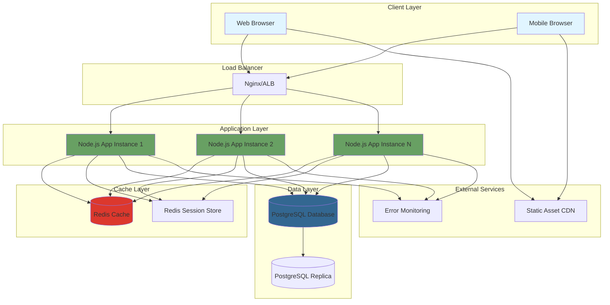

---

## Application Layers

### Layer Architecture

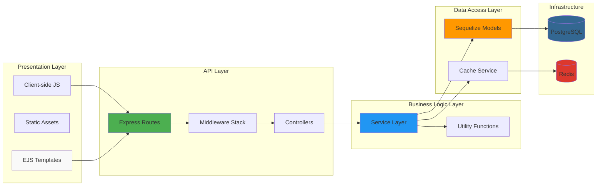

### Directory Structure

```
bluebonnet/
├── config/              # Configuration files
│   ├── database.js      # Database configuration
│   └── passport.js      # Authentication configuration
├── controllers/         # Request handlers
│   ├── tripController.js
│   ├── flightController.js
│   └── ...
├── models/              # Sequelize models (Data layer)
│   ├── User.js
│   ├── Trip.js
│   └── ...
├── routes/              # Express routes (API layer)
│   ├── index.js
│   ├── trips.js
│   ├── api/             # API v1 routes
│   └── ...
├── services/            # Business logic layer
│   ├── tripService.js
│   ├── airportService.js
│   ├── cacheService.js
│   └── ...
├── middleware/          # Express middleware
│   ├── auth.js
│   ├── errorHandler.js
│   └── ...
├── utils/               # Utility functions
│   ├── logger.js
│   ├── redis.js
│   └── ...
├── views/               # EJS templates
│   ├── trips/
│   ├── partials/
│   └── ...
├── public/              # Static assets
│   ├── js/
│   ├── css/
│   └── dist/            # Built assets
└── tests/               # Test suites
    ├── unit/
    └── integration/
```

---

## Database Architecture

### Entity Relationship Diagram

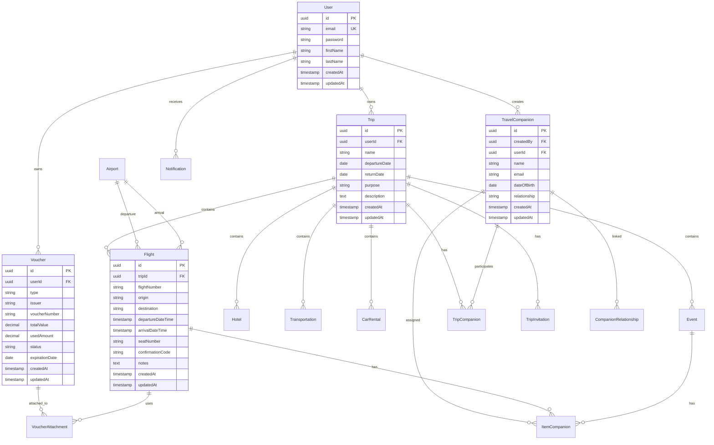

### Database Indexes

Key indexes for performance optimization:

- **Users**: `email` (unique), `id` (primary key)
- **Trips**: `userId`, `departureDate`, `returnDate`
- **Flights**: `tripId`, `departureDateTime`, `origin`, `destination`
- **Airports**: `iata` (primary key), `city`, `name`
- **Vouchers**: `userId`, `status`, `expirationDate`
- **TravelCompanions**: `createdBy`, `userId`, `email`

---

## Authentication Flow

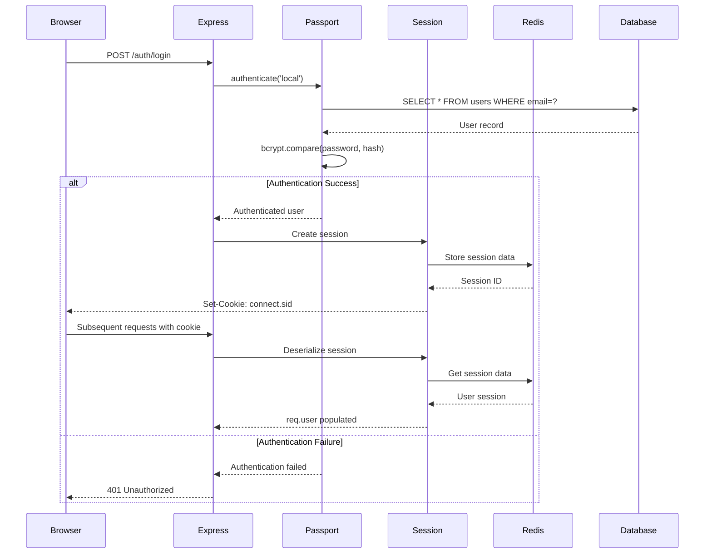

---

## Caching Strategy

### Cache Architecture

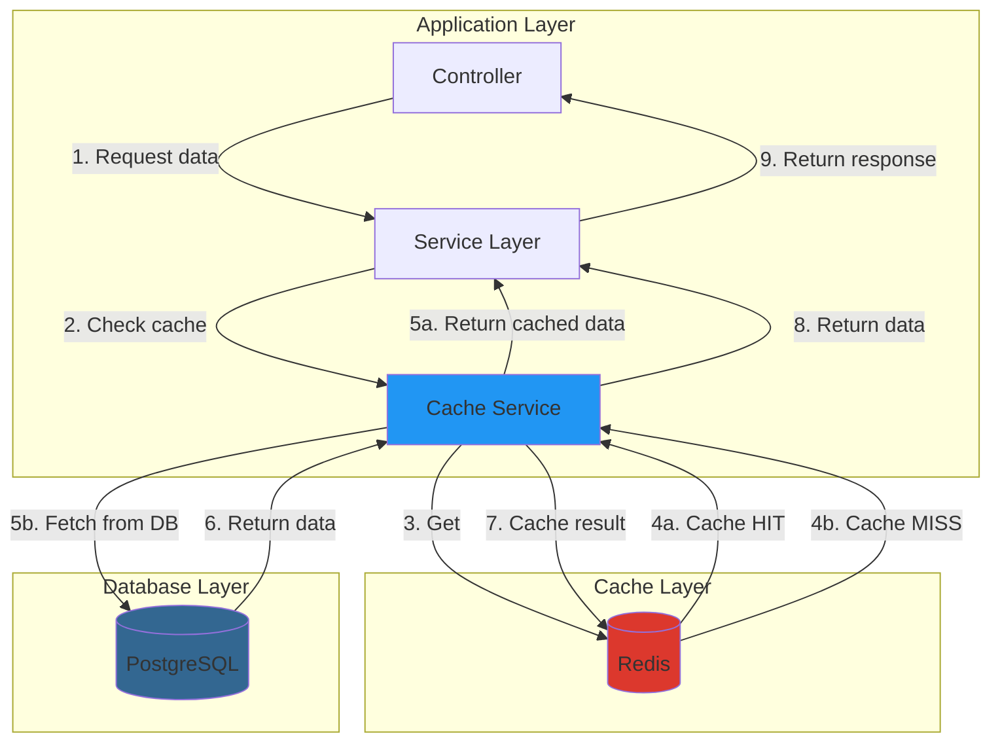

### Cache Keys & TTLs

| Data Type       | Cache Key Pattern                     | TTL        | Invalidation            |
| --------------- | ------------------------------------- | ---------- | ----------------------- |
| Airports        | `airport:code:{IATA}`                 | 24 hours   | Never (static data)     |
| Airport Search  | `airport:search:{query}:{limit}`      | 24 hours   | Never                   |
| User Trips      | `trips:user:{userId}:{filter}:{page}` | 5 minutes  | On create/update/delete |
| Trip Statistics | `trips:stats:{userId}`                | 10 minutes | On trip changes         |
| User Companions | `companions:user:{userId}`            | 5 minutes  | On create/update/delete |
| User Vouchers   | `vouchers:user:{userId}`              | 5 minutes  | On create/update/delete |
| Sessions        | `sess:{sessionId}`                    | 24 hours   | On logout               |

---

## Request Flow

### Standard HTTP Request Flow

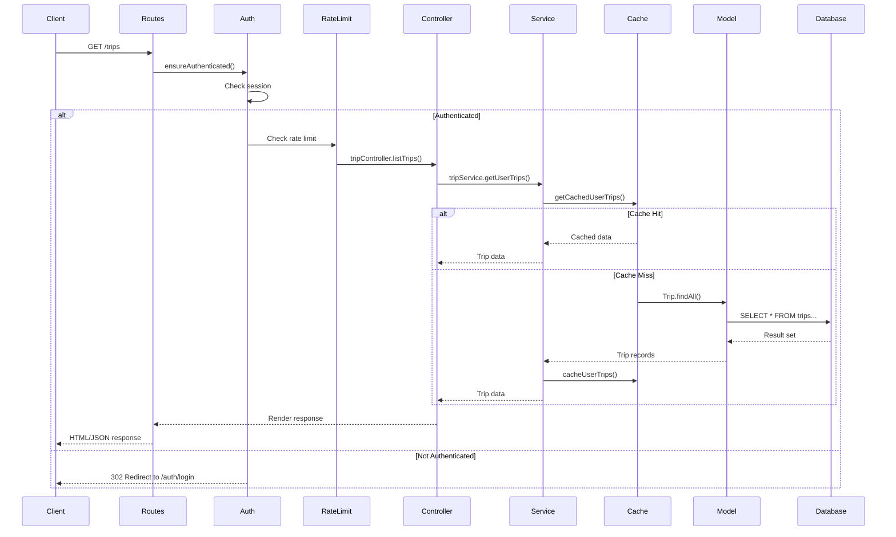

### API Request Flow (JSON)

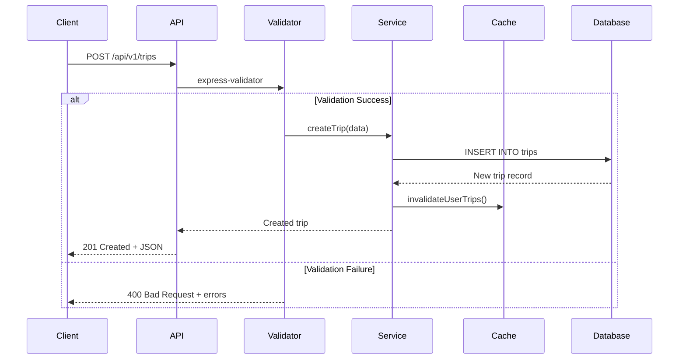

---

## Service Layer Architecture

### Service Pattern

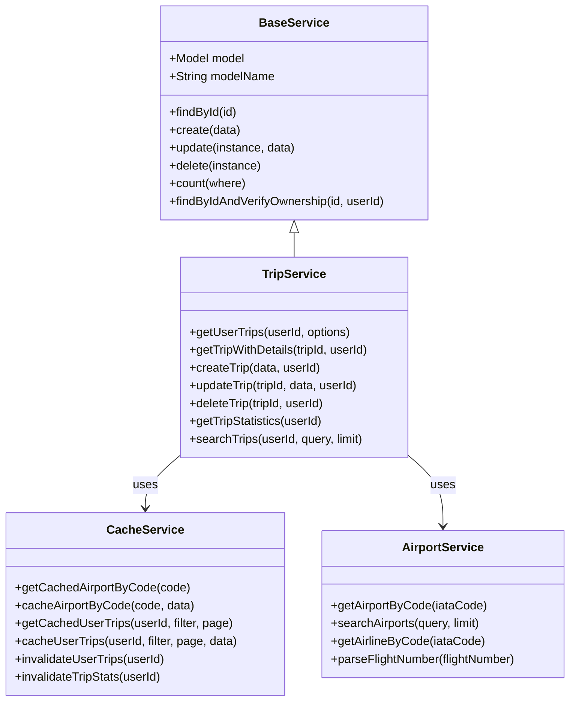

---

## Deployment Architecture

### Docker Compose (Development)

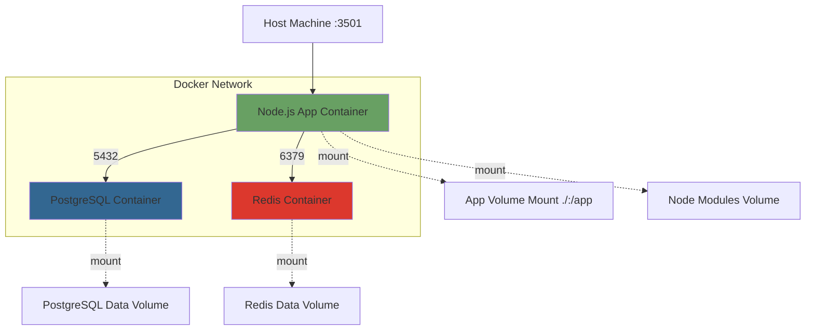

### Production Deployment (Multi-Stage Docker)

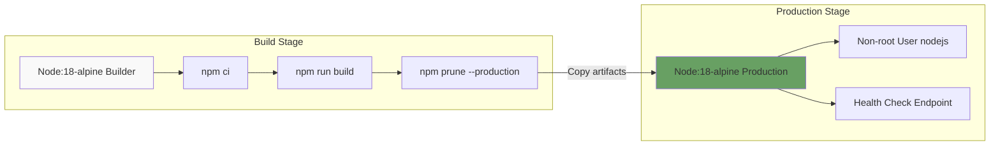

---

## Technology Decisions

### Why These Technologies?

| Technology     | Reason                                                                     |
| -------------- | -------------------------------------------------------------------------- |
| **Node.js**    | Non-blocking I/O, excellent for I/O-heavy operations, large ecosystem      |
| **Express**    | Minimal, flexible, industry standard, excellent middleware ecosystem       |
| **PostgreSQL** | ACID compliance, complex queries, JSON support, strong consistency         |
| **Redis**      | In-memory speed, persistence, pub/sub, session storage                     |
| **EJS**        | Server-side rendering for SEO, simple syntax, works well with Express      |
| **esbuild**    | 100x faster than webpack, simple configuration, native ESM support         |
| **Jest**       | All-in-one testing solution, excellent mocking, great developer experience |
| **Sequelize**  | Mature ORM, good PostgreSQL support, migration system                      |

---

## Security Architecture

### Security Layers

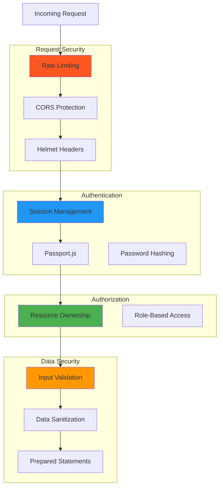

---

## Performance Optimizations

### Implemented Optimizations

1. **Redis Caching**
   - Airport data: 24-hour TTL (static data)
   - User trips: 5-minute TTL with invalidation
   - Session storage: Redis-backed sessions

2. **Database Indexing**
   - Strategic indexes on frequently queried columns
   - Composite indexes for common query patterns

3. **Code Splitting**
   - esbuild bundles with code splitting
   - Separate bundles per page (dashboard, trip-view, map-view)
   - Shared chunks for common code

4. **Compression**
   - Gzip compression for all HTTP responses
   - Reduces bandwidth by ~70%

5. **Connection Pooling**
   - Sequelize connection pool (max 5 connections)
   - Redis connection reuse

---

## Monitoring & Observability

### Health Check Response

```json
{
  "status": "ok",
  "timestamp": "2025-11-19T14:30:00.000Z",
  "uptime": 3600,
  "environment": "production",
  "version": "1.0.0",
  "database": "connected",
  "redis": "connected"
}
```

### Logging Strategy

- **Winston** for structured logging
- Log levels: error, warn, info, debug
- Separate log files for errors
- Daily log rotation
- JSON format for easy parsing

---

## Future Architecture Considerations

1. **Microservices Migration**
   - Split into airport, trip, auth, notification services
   - API Gateway pattern
   - Service mesh (Istio/Linkerd)

2. **Event-Driven Architecture**
   - Message queue (RabbitMQ/Kafka)
   - Async job processing
   - Event sourcing for audit trail

3. **GraphQL API**
   - Alternative to REST
   - Client-driven queries
   - Reduced over-fetching

4. **Serverless Functions**
   - Lambda/Cloud Functions for batch jobs
   - Scheduled tasks (voucher expiration checks)
   - Email notifications

---

## References

- [Express.js Best Practices](https://expressjs.com/en/advanced/best-practice-performance.html)
- [PostgreSQL Performance Tips](https://www.postgresql.org/docs/current/performance-tips.html)
- [Redis Best Practices](https://redis.io/docs/manual/patterns/)
- [Node.js Best Practices](https://github.com/goldbergyoni/nodebestpractices)
